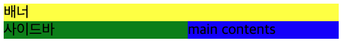
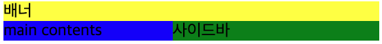

## float
float는 해당 요소를 어떻게 정렬할지를 정의 할 수 있습니다.  
float는 묶음 태그(block element)에만 적용 가능합니다.  
주로 이미지에 float를 적용하여 이미지를 텍스트로 감쌀 때 많이 사용합니다.  
* 묶음 태그 : img, div, p, ul, ol, table 등

<br>

실습을 해보도록 하겠습니다.
배너, 사이드바, main contents 영역을 만들고 사이드바에 float를 적용하도록 하겠습니다.  

html 코드

```html
<h3>assignment 1</h3>
    <div class="main-page">
      <header>배너</header>
      <aside>사이드바</aside>
      <section>main contents</section>
    </div>
    
    <h3>assignment 2</h3>
    <div class="home-page">
      <header>배너</header>
      <aside>사이드바</aside>
      <section>main contents</section>
    </div>
```

<br>

사이드바(초록색)에 float 왼쪽으로 설정

```css
.main-page aside{
  float: left;
  width: 200px;
}
```
결과



<br>

사이드바(초록색)에 float 오른쪽으로 설정
```css
.home-page aside{
  float: right;
  width: 200px;
}
```
결과

