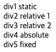
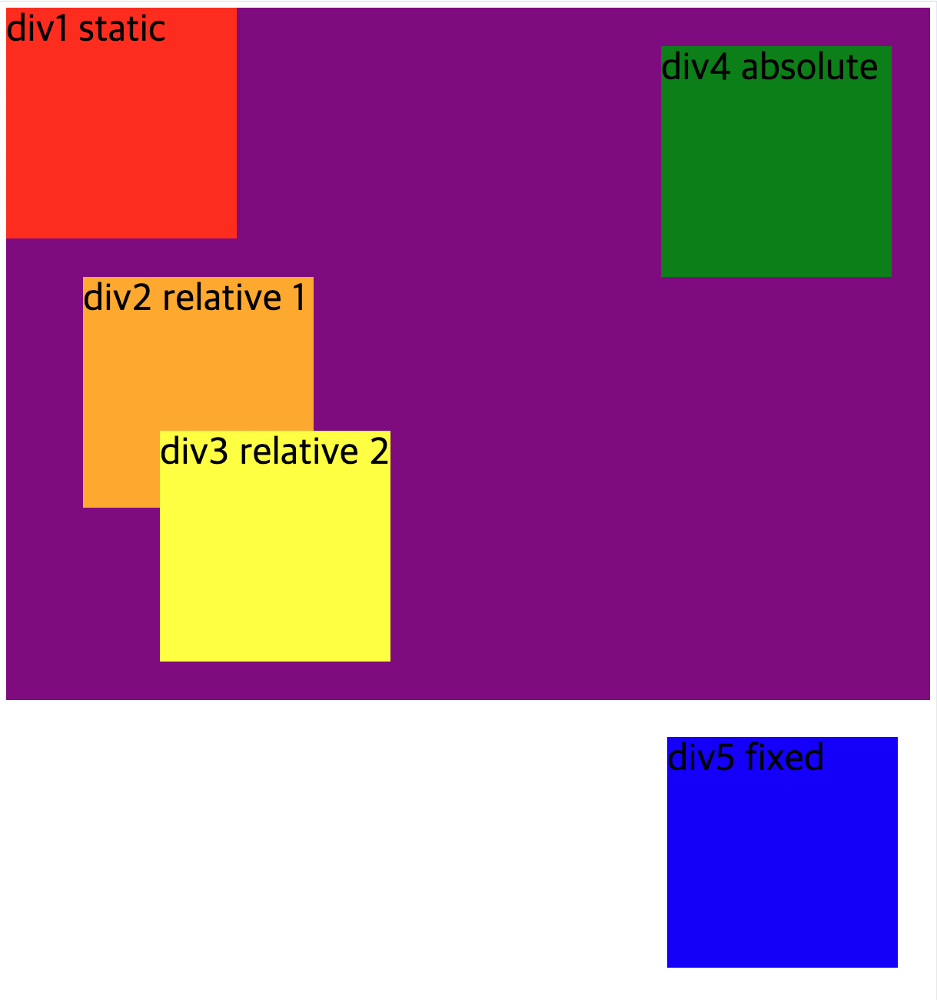

### Position

Position은 각 요소의 위치를 지정하는 css의 프로퍼티로 CSS layout을 만들기 위해 자주 사용합니다.

>  layout이란 웹사이트를 구성하는 요소들을 배치할 공간을 분할하고 정렬하는 것이다.

우선 Position의 종류에는 무엇이 있을까요?

**static, relative, absolute, fixed**

각각의 요소의 특징에 대해 알아보고 실습해 보겠습니다.

<br>

1. static  
   별도로 position 값을 지정하지 않았다면 position : static으로 적용되어 있는 것입니다. static은 기본값으로 요소가 순서대로 위치하게 됩니다.

2. relative  
   relative은 기본값(static)에서부터 위치를 설정할 때 사용합니다.

3. absolute
   absolute는 static, relative와 달리 기본값의 법칙을 지키지 않습니다. 기본값이 아닌 부모 요소를 기준으로 위치를 잡습니다.(부모를 기준으로 하기 위해선 부모 요소에 position값으로 relative 혹은 absolute 를 설정해줘야 합니다.)

4. fixed
   fixed 또한 기본값을 지키지 않습니다. 화면에 고정시킬 때 사용하는 속성으로 nav와 같은 영역에 많이 사용합니다. 즉, 화면에서 스크롤을 아무리 내린다해도 상관없이 고정되는 것입니다.


<br>

그럼, 실습을 해보도록 하겠습니다.

다양한 방법으로 Postion을 지정해 볼 div 5개를 만들었습니다. 그리고 부모 div로 감싸주었습니다.

```html
<!DOCTYPE html>
<html lang="en">
  <head>
    <meta charset="UTF-8" />
    <meta name="viewport" content="width=device-width, initial-scale=1.0" />
    <title>Document</title>
    <link rel="stylesheet" href="test.css" />
  </head>
  <body>
    <div class="div_parents">
      <div class="div1">div1 static</div>
      <div class="div2">div2 relative 1</div>
      <div class="div3">div3 relative 2</div>
      <div class="div4">div4 absolute</div>
      <div class="div5">div5 fixed</div>
    </div>
  </body>
</html>

```

<br>

html만 작성했을 때는 아래와 같이 나오게 됩니다.  
아래와 같이 아무 설정 안했을때 기본값으로 정렬되는 것이 static입니다.



<br>
<br>

다음으로 css를 적용해보도록 하겠습니다.  
css가 완료된 결과는 가장 아래를 참고하시기 바랍니다.


우선 5개의 div에 영역을 지정하기 위해 width, height 값을 주었습니다.

```css
.div1,
.div2,
.div3,
.div4,
.div5 {
  width: 300px;
  height: 300px;
  font-size: 50px;
}
```

<br>
div1은 static 지정을 위해 아무 position도 지정하지 않았습니다.

```css
.div1 {
  background-color: red;
}
```


<br>
div2, div3 에는 relative를 적용했습니다.

화면과 같이 div2, div3 모두 각자의 기본값의 위치를 기준으로 설정한 top, left 기준으로 이동한 것을 알 수 있습니다.

```css
.div2 {
  background-color: orange;
  position: relative;
  top: 50px;
  left: 100px;
}

.div3 {
  background-color: yellow;
  position: relative;
  top: -50px;
  left: 200px;
}
```


<br>
div4(초록색)에는 absolute를 지정하여 부모 요소(보라색)를 기준으로 위치가 지정되게 됩니다.  
부모요소인 div_parents에도 position: relative 를 적용했습니다.

```css

.div4 {
  background-color: green;
  position: absolute;
  top: 50px;
  right: 50px;
}

.div_parents {
  position: relative;
  background-color: purple;
}
```


<br>
마지막으로 fixed 입니다.  
div5(파란색)는 fixed로 지정하여 bottom에서 50px, right에서 50px로 화면에 고정한 것입니다.  
스크롤을 아무리 위아래로 움직여도 div5는 현재 위치에서 고정되어 움직이지 않을 것입니다.

```css
.div5 {
  background-color: blue;
  position: fixed;
  bottom: 50px;
  right: 50px;
}

body {
  height: 5000px;
}
```


<br>

**최종 결과**

