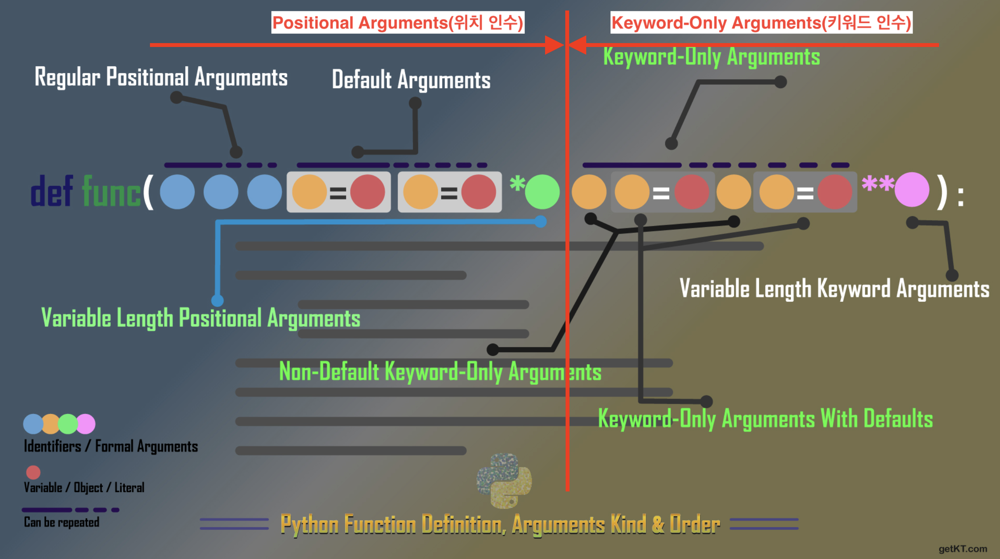

python funtion에서 사용되는 arguments와 parameter에 대해 이해해보도록 하겠습니다.
Funtion의 code를 보면 대략 어떻게 적용되는지 알 것 같은데 상세하게 들어가면 용어가 많고 입출력 원리 등을 이해하는게 어려웠습니다.

하나씩 살펴보도록 할게요.  

우선 가장 큰 개념인 Arguments와 Parameter는 유사하지만 의미가 좀 달라요.
- Arguemnts(인수/인자/전달인자) : 함수와 메서드의 입력 값(Value)
- Parameter(매개 변수 or 파라미터) : 함수와 메서드의 입력 변수(Variable) 명

간단한 코드로 보여드릴게요.

  ```python
def plus(a, b):
    print(a + b)
    
plus(3,4)
```
여기서 a, b(변수)는 parameter이고 3, 4(값)는 arguments 입니다.  


자, 이제 복잡한 Arguments의 전체 구조에 대해 알아보려고 합니다.  
Arguments를 완전히 이해하기 위해선 이 사진을 반드시 이해해야 해요.  
되게 복잡해 보이는데 이해하고 나면 되게 잘 정리했다는 느낌을 받으실 거에요.



자, 우선 Arguments는 크게 2가지로 나뉩니다.  
Positional arguments 영역과 Keyword-only Arguments 영역입니다.  
(영역이라는 말은 잘 안쓰나 이해를 위해 썼습니다.)


#### Positional arguments(위치 인수)
    위치가 설정된 인수를 포괄적인 의미를 뜻합니다.  

    Default Arguemnts는 Positional에 기반하여 함수를 호출하기 때문에 Regular Positional Arguments 앞에 위치 할 수 없습니다. 

    위 그림에서 첫 번째 인수부터 Variable Length Positional Arguments까지에 해당됩니다.
    - Regular Positional Arguments (기본값이 없는 위치 인수)
    - Default Arguments (기본값이 있는 위치 인수)
    - Variable Length Positional Arguments(가변 위치 인수) (feat. *args) 

<br>

#### Keyword-only Arguments (키워드 전용 인수)
    오직 keyword로만 함수를 호출할 수 있는 인수의 포괄적인 의미로 Non-default Keyword-only Arguments, Default Keyword-only Arguments, Variable Length Keyword Arguments 등의 개념을 뜻합니다.  

    Default Keyword-only Arguments는 Keyword를 기반으로 함수를 호출을 하기 때문에 Non-Default Keyword-only Arguments 과 순서가 바뀌어도 상관없습니다.  

    위 그림에서 Variable Length Positional Arguments부터 마지막까지 해당됩니다.
    - Non-default Keyword-only Arguments (기본값이 없는 키워드 전용 인수)
    - Default Keyword-only Arguments (기본값이 있는 키워드 전용 인수)
    - Variable Length Keyword Arguments(가변 키워드 인수) (feat. **kwargs)

<br>
<br>


 바로 예제를 통해 알아봅시다.  
 

**예제 1)**

```python
def text(age="25", name):
    print(age)
    print(name)
    
text("tomas")
```

**에러내용**  
SyntaxError: non-default argument follows default argument

<br>

에러 내용을 보면 non-default argument(name)가 default argument에 자리에 있어서 에러가 난 것을 확인할 수 있습니다.  

코드를 고쳐보겠습니다.  

```python
def text(name, age="25"):
    print(age)
    print(name)
    
text("tomas")
```

**코드 결과값**  
25  
tomas  
<br>
Default Arguments Regular Positional Arguments 뒤로 위치하니 정상적으로 출력되는 것을 볼 수 있습니다.

<br>
<br>

여러가지 예제를 더 작성하겠습니다.  

<br>

**예제 2)**

```python
def func_param_with_var_args(name, *args, age):
    print("name=",end=""), print(name)
    print("args=",end=""), print(args)
    print("age=",end=""), print(age)


func_param_with_var_args("정우성", "01012341234", "seoul", 20)
```

여기서 발생되는 에러는 age가 *args 뒤로 간 것입니다.  
해결 방법은 2가지가 있습니다  

해결 1 : age를 Regular Positional Arguments로 적용
해결 2 : age를 Non-default Keyword-only Arguments로 적용

해결 1 code  
```python
def func_param_with_var_args(name, age, *args):
    print("name=",end=""), print(name)
    print("age=",end=""), print(age)
    print("args=",end=""), print(args)

func_param_with_var_args("정우성", 20, "01012341234", "seoul")
```

<br>

결과 값
```
name=정우성
age=20
args=('01012341234', 'seoul')
```

<br>

해결 2 code
```python
def func_param_with_var_args(name, *args, age):
    print("name=",end=""), print(name)
    print("args=",end=""), print(args)
    print("age=",end=""), print(age)

func_param_with_var_args("정우성", "01012341234", "seoul", age = 20)
```
<br>
결과 값
```
name=정우성
args=('01012341234', 'seoul')
age=20
```

<br>


**예제 2)**

```python
def func_param_with_kwargs(name, age, **kwargs, address=0):
    print("name=",end=""), print(name)
    print("age=",end=""), print(age)
    print("kwargs=",end=""), print(kwargs)
    print("address=",end=""), print(address)


func_param_with_kwargs("정우성", "20", mobile="01012341234", address="seoul")
```

위 코드는 Default Keyword-only Arguments(address=0)가 Variable Length Keyword Arguments(**kwargs) 보다 뒤로 가서 에러가 발생합니다. 가변인수인 **kwargs가 모든 arguments 값을 호출해버리기 때문에 address로 호출할 인자가 없기 때문입니다.  

코드를 수정 해보도록 하겠습니다.  

수정 코드
```python
def func_param_with_kwargs(name, age, address=0, **kwargs):
    print("name=",end=""), print(name)
    print("age=",end=""), print(age)
    print("kwargs=",end=""), print(kwargs)
    print("address=",end=""), print(address)


func_param_with_kwargs("정우성", "20", mobile="01012341234", address="seoul")
```
<br>
**결과 값**  

```
name=정우성
age=20
kwargs={'mobile': '01012341234'}
address=seoul
```

<br>
<br>

**예제 3)**
*args, **kwargs 등 혼용하여 사용하도록 하겠습니다.

```python
def mixed_params(name="아이유", *args, age, **kwargs, address):
    print("name=",end=""), print(name)
    print("args=",end=""), print(args)
    print("age=",end=""), print(age)
    print("kwargs=",end=""), print(kwargs)
    print("address=",end=""), print(address)


mixed_params(20, "정우성", "01012341234", "male" ,mobile="01012341234", address="seoul")
```

에러가 발생됩니다. Arguments 순서가 뒤죽박죽 섞여 있습니다.  
positional arguments에서 keyword-only arguments로 순서를 변경하였습니다.

**수정코드**  

```python
def mixed_params(age, name="아이유", *args, address, **kwargs):
    print("age=",end=""), print(age)
    print("name=",end=""), print(name)
    print("args=",end=""), print(args)
    print("address=",end=""), print(address)
    print("kwargs=",end=""), print(kwargs)
    


mixed_params(20, "정우성", "01012341234", "male" , address="seoul", mobile="01012341234")
```

<br>

**결과 값**

```
age=20
name=정우성
args=('01012341234', 'male')
address=seoul
kwargs={'mobile': '01012341234'}
```

<br>
<br>

마지막으로 모든 타입의 인수를 넣은 예제를 보겠습니다.

**예제 4)**

```python
def exam(
    a, b, name="아이유", nation="한국", *args, address_01="서울시 강남구", age_01, age_02, address_02="서울시 서초구", **kwargs
):
    # a : Regular Positional Arguments
    # b : Regular Positional Arguments
    # name="아이유" : Default Arguments
    # nation="한국" : Default Arguments
    # *args : Variable Length Positional Arguments
    # address_01="서울시 강남구" : Defaults Keyword-Only Arguments
    # age_01 : Non-defaults Keyword-Only Arguments
    # age_02 : Non-defaults Keyword-Only Arguments
    # address_02="서울시 서초구" : Defaults Keyword-Only Arguments
    # **kwargs : Variable Length Keyword Arguments

    print(a)
    print(b)
    print(name)
    print(nation)
    print(args)
    print(age_01)
    print(address_01)
    print(age_02)
    print(address_02)
    print(kwargs)


exam(
    "난 a", "난 b", "아이유 말고 정우성", "대한민국", "male", "01012341234", 1, 1.5, 2, age_01=20,address_02="서울 아니고 성남", age_02=80, mobile1="01012341234", mobile2="01001010101", mobile3="23423423423"
)

```

출력 결과값
```
난 a
난 b
아이유 말고 정우성
대한민국
('male', '01012341234', 1, 1.5, 2)
20
서울시 강남구
80
서울 아니고 성남
{'mobile1': '01012341234', 'mobile2': '01001010101', 'mobile3': '23423423423'}
```


내용이 많아 좀 더 간결하게 작업을 하는 중이니 참고해주세요!  
updated on 2020-10-23
