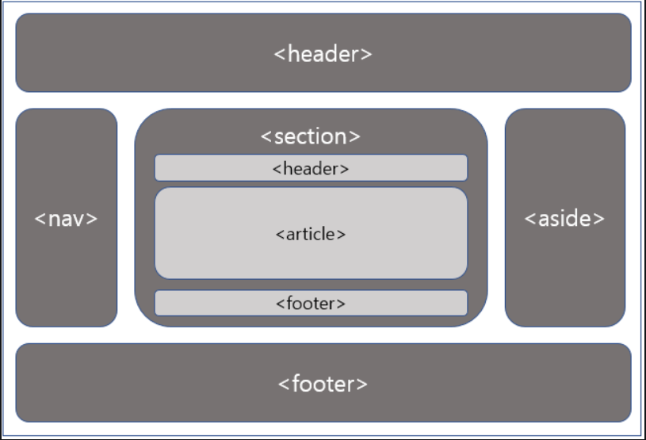

## Semantic Web이란?

시맨틱 웹(Semantic Web)은 "의미론적인 웹"이라는 뜻으로, 기계가 이해할 수 있는 형태로 제작된 웹을 뜻합니다.  
시맨틱웹은 웹이 초창기와 달리 정보가 급격하게 쌓이면서 사람 대신 기계가 웹 페이지의 정보를 이해하고, 유저가 원하는 정보를 가공해서 보여주는 웹입니다.

 

## Semantic Tag이란?

Semantic Tag는 일반적인 태그(div, a, p)와 달리 기능을 위한 태그는 아닙니다.  
기능과는 상관없지만 의미론적으로 사용하는 태그를 뜻합니다.

아래 사진과 같이 Semantic Tag를 사용해서 구분하면 수월하게 Web 구조를 만들 수 있습니다.

 

**non-semantic 요소**  
div, span, a, p와 같이 tag 자체가 content에 대한 의미론적인 설명을 하지 않습니다.

**semantic 요소**  
header, nav, section, table, article, img 등이 있으며 tag를 보면 content의 의미론적인 내용을 알 수 있습니다.  

 

Semantic tag를 사용한 레이아웃 예시

 

웹에 이미지를 넣는 2가지 방법과 사용 경우  
**img tag 사용**  
* Semantic tag를 이용한 방법으로 의미적으로 image를 강조하는 경우
* img tag에 alt와 같은 attribute를 사용하여 검색엔진 노출 등 좀 더 데이터적인 활용을 하는 경우
* 이미지가 콘텐츠의 중요 역할을 하는 경우

**background-image 사용**
* 이미지가 배경 전체에 확대해 사용하는 경우
* hover 기능 등과 같이 부분적으로 활용하는 경우

> Semantic tag이자 데이터적으로 활용할 수 있는 img tag를 사용하는 것이 좀 더 권장되고 있습니다.