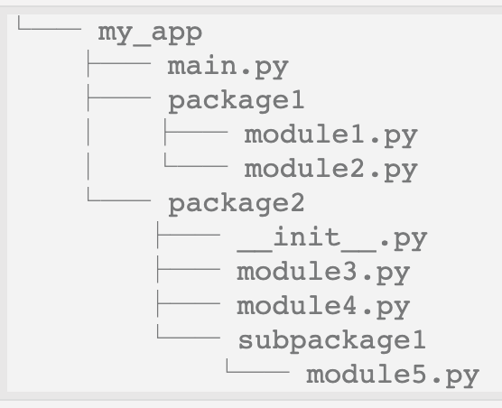

### 파이썬에서 패키지나 모듈 호출 순서

파이썬에서 패키지나 모듈을 호출할 때는 찾는 순서가 있습니다.

> sys.modules -> built-in modules -> sys.path -> 그래도 못 찾으면? Error 발생!!

이런 순서입니다.  
각 순서는 어떻게 다른 것일까요.


#### 1) sys.modules

<br>

- Sys.modules는 단순한 Dictionary 형태입니다.
- Python 설치하며 동시에 importe된 package/module을 저장하고 있고 새로 설치되는 package/import는 저장되지 않습니다.
- 파이썬에서 sys.module을 출력 해보도록 하겠습니다.

  ```python
  import sys
  print(sys.modules)
  ```


sys.modules 출력 결과를 보면 뭔가 잔득 나왔습니다.  
출력된 내용을 자세히 보면 dictionary 형태인 것을 알 수 있습니다.

```
{'sys': <module 'sys' (built-in)>, 'builtins': <module 'builtins' (built-in)>, '_frozen_importlib': <module '_frozen_importlib' (frozen)>, '_imp': <module '_imp' (built-in)>, '_warnings': <module '_warnings' (built-in)>, '_frozen_importlib_external': <module '_frozen_importlib_external' (frozen)>, '_io': <module 'io' (built-in)>, 'marshal': <module 'marshal' (built-in)>, 'posix': <module 'posix' (built-in)>, '_thread': <module '_thread' (built-in)>, '_weakref': <module '_weakref' (built-in)>, 'time': <module 'time' (built-in)>, 'zipimport': <module 'zipimport' (frozen)>, '_codecs': <module '_codecs' (built-in)>, 'codecs': <module 'codecs' from '/Library/Frameworks/Python.framework/Versions/3.8/lib/python3.8/codecs.py'>, 'encodings.aliases': <module 'encodings.aliases' from '/Library/Frameworks/Python.framework/Versions/3.8/lib/python3.8/encodings/aliases.py'>, 'encodings': <module 'encodings' from '/Library/Frameworks/Python.framework/Versions/3.8/lib/python3.8/encodings/__init__.py'>, 'encodings.utf_8': <module 'encodings.utf_8' from '/Library/Frameworks/Python.framework/Versions/3.8/lib/python3.8/encodings/utf_8.py'>, '_signal': <module '_signal' (built-in)>, '__main__': <module '__main__' from '52.py'>, 'encodings.latin_1': <module 'encodings.latin_1' from '/Library/Frameworks/Python.framework/Versions/3.8/lib/python3.8/encodings/latin_1.py'>, '_abc': <module '_abc' (built-in)>, 'abc': <module 'abc' from '/Library/Frameworks/Python.framework/Versions/3.8/lib/python3.8/abc.py'>, 'io': <module 'io' from '/Library/Frameworks/Python.framework/Versions/3.8/lib/python3.8/io.py'>, '_stat': <module '_stat' (built-in)>, 'stat': <module 'stat' from '/Library/Frameworks/Python.framework/Versions/3.8/lib/python3.8/stat.py'>, '_collections_abc': <module '_collections_abc' from '/Library/Frameworks/Python.framework/Versions/3.8/lib/python3.8/_collections_abc.py'>, 'genericpath': <module 'genericpath' from '/Library/Frameworks/Python.framework/Versions/3.8/lib/python3.8/genericpath.py'>, 'posixpath': <module 'posixpath' from '/Library/Frameworks/Python.framework/Versions/3.8/lib/python3.8/posixpath.py'>, 'os.path': <module 'posixpath' from '/Library/Frameworks/Python.framework/Versions/3.8/lib/python3.8/posixpath.py'>, 'os': <module 'os' from '/Library/Frameworks/Python.framework/Versions/3.8/lib/python3.8/os.py'>, '_sitebuiltins': <module '_sitebuiltins' from '/Library/Frameworks/Python.framework/Versions/3.8/lib/python3.8/_sitebuiltins.py'>, 'site': <module 'site' from '/Library/Frameworks/Python.framework/Versions/3.8/lib/python3.8/site.py'>}
```

<br>

#### 2) built-in modules

- built-in은 내장된 이라는 뜻으로 python에서 공식적으로 제공하는 Library 입니다.
- 첫번째로 탐색하는 sys 또한 built-in 이며 그 외 time, os 등이 있고 위의 검색 결과를 보니 builtins, _frozen_importlib, _imp 등 들어본적 없는 모듈들도 있습니다.

<br>

#### 3) sys.path

- 모듈의 검색 경로를 지정하는 문자열 리스트입니다.
- sys.modules와 달리 sys.path는 list 형태로 되어 있습니다. 파이썬에서 출력해보도록 하겠습니다.
- pip으로 package/module 설치시 리스트 마지막의 site-packages에 저장이 됩니다.

```python
import sys
print(sys.path)
```


출력결과

```
['/Users/jeongsikkim/Documents/replit_python', '/Library/Frameworks/Python.framework/Versions/3.8/lib/python38.zip', '/Library/Frameworks/Python.framework/Versions/3.8/lib/python3.8', '/Library/Frameworks/Python.framework/Versions/3.8/lib/python3.8/lib-dynload', '/Users/jeongsikkim/Library/Python/3.8/lib/python/site-packages', '/Library/Frameworks/Python.framework/Versions/3.8/lib/python3.8/site-packages']
```


<br>

<br>


### sys는 어디 위치하는 것일까?  
<br>

그럼 sys는 어디에 위치하는 것일지 궁금해집니다.  
sys.builtin_module_names는 파이썬 인터프리터로 컴파일된 모든 내장 모듈(built-in modules)의 이름을 튜플로 제공하는 코드입니다.  
파이썬에서 출력해보겠습니다.

```python
import sys
print(sys.builtin_module_names)
```

출력결과

```
('_abc', '_ast', '_codecs', '_collections', '_functools', '_imp', '_io', '_locale', '_operator', '_signal', '_sre', '_stat', '_string', '_symtable', '_thread', '_tracemalloc', '_warnings', '_weakref', 'atexit', 'builtins', 'errno', 'faulthandler', 'gc', 'itertools', 'marshal', 'posix', 'pwd', 'sys', 'time', 'xxsubtype')
```

이로써 sys는 인터프리터에 내장되어 있다는 것을 확인 할 수 있습니다.  
그 외 다양한 sys - 시스템의 특정 파라미터와 함수는 아래 공식 문서를 참고하시기 바랍니다.

https://docs.python.org/ko/3/library/sys.html?highlight=sys%20modules#sys.modules

<br>

<br>

위에서 확인헀듯 파이썬의 기본 모듈과 pip 등으로 설치한 패키지/모듈은 별도의 경로 없이도 import가 가능합니다.

위에서 sys modules을 딕셔너리로 출력한 것 기억나시나요?

> 'sys': <module 'sys' (built-in)>

sys 모듈은 built-in module에서 경로를 가져오기 때문에 별도의 경로를 설정할 필요가 없는 것입니다.


<br>
<br>

### Absolute path(절대 경로)와 Relative path(상대 경로)

<br>

문제는 직접 작성한 Package나 Module은 정확한 경로를 import해야 사용할 수 있습니다.  
경로를 설정하는 방법은 2가지가 있습니다.

1. Absolute path(절대 경로)
2. Relative path(상대 경로)

만약 다음과 같은 프로젝트가 있다고 예를 들어 보겠습니다.



<br>

#### Absolute path(절대 경로)

- 최상단(current directory)를 기준으로한 경로입니다.
- Import 하고자 하는 파일 위치와 상관없이 절대적인 경로입니다.
- 경로가 길어질 수 있으나 일반적인 경우는 absolute path 사용을 권장합니다.
- 절대 경로 예시

> from package1 import module1   
> from package1.module2 import function1   
> from package2 import class1   
> from package2.subpackage1.module5 import function2  

<br>

#### Absolute path(절대 경로)

- Import 하고자 하는 파일 위치를 기준으로한 경로입니다.
- 절대 경로에 비해 경로가 짧은게 장점이지만 파일 위치가 변경되면 경로도 변경해줘야 하기때문에 실수할 확률이 높습니다.
- 상대 경로 예시

> <in package2/module3.py>  
> from . import class1   
> from .subpackage1.module5 import function2  
><br>
> <in subpackage1/module5.py>  
> from ..module4 import class4