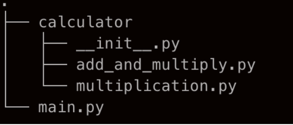

calculator package를 직접 만들어보며 상대 경로와 절대 경로를 비교해보겠습니다.

directory 구조는 아래와 같습니다.



각 파일의 코드 내용입니다.

```python
# in main.py

# relative path
from .calculator.add_and_multiply import add_and_multiply

if __name__ == '__main__':
    print(add_and_multiply(1,2))
```

```python
# in add_and_multiply.py

from .multiplication import multiply
# from calculator.multiplication import multiply
def add_and_multiply(a,b):
    return multiply(a,b) + (a+b)
```

```python
# in multiplication.py

def multiply(a,b):
    return(a*b)
```

위와 같이 python을 실행하면 어떻게 될까요?
main.py에서 아래와 같은 Error가 발생합니다.
**ImportError: attempted relative import with no known parent package**  
> Note that relative imports are based on the name of the current module. Since the name of the main module is always "__main__", modules intended for use as the main module of a Python application must always use absolute imports.

번역
> 상대적 가져 오기는 현재 모듈의 이름을 기반으로합니다. 주 모듈의 이름은 항상 "__main__"이므로 Python 애플리케이션의 주 모듈로 사용하려는 모듈은 항상 절대 가져 오기를 사용해야합니다.

그렇습니다. main.py는 같은 프로젝트는 맞으나 같은 패키지가 아니기 때문에 항상 절대 경로로 패키지/모듈을 설정해줘야 합니다.
main.py의 import를 절대 경로로 수정해보도록 하겠습니다.

```python
# absoulte path
from calculator.add_and_multiply import add_and_multiply 

if __name__ == '__main__':
    print(add_and_multiply(1,2))
```

출력값
5

정상적으로 값이 출력되었습니다.

<br>
<br>

그럼 같은 directory 내 패키지끼리의 import는 어떨까요?
위에서 add_and_multiply.py에서 multiply 함수를 상대 경로로 import 했을 때 정상적으로 작동이 되었습니다.  
그럼 절대 경로도 마찬가지로 정상적으로 작동하는지 확인해보겠습니다.

```python
# in add_and_multiply.py

# from .multiplication import multiply
from calculator.multiplication import multiply
def add_and_multiply(a,b):
    return multiply(a,b) + (a+b)
```

절대 경로도 마찬가지로 import가 정상적으로 작동됩니다.  
즉, 같은 패키지끼리는 절대 경로와 상대 경로 모두 가능한 것을 확인 할 수 있습니다.

<br>
<br>

마지막으로 패키지 폴더에 보면 __init__.py 이라는 파일이 있는데 왜 있는 걸까요? 심지어 파일안에는 아무 코드도 없습니다. 그 이유는 init 파일은 해당 디렉토리가 패키지임을 알려주는 역할을 하기 떄문입니다.